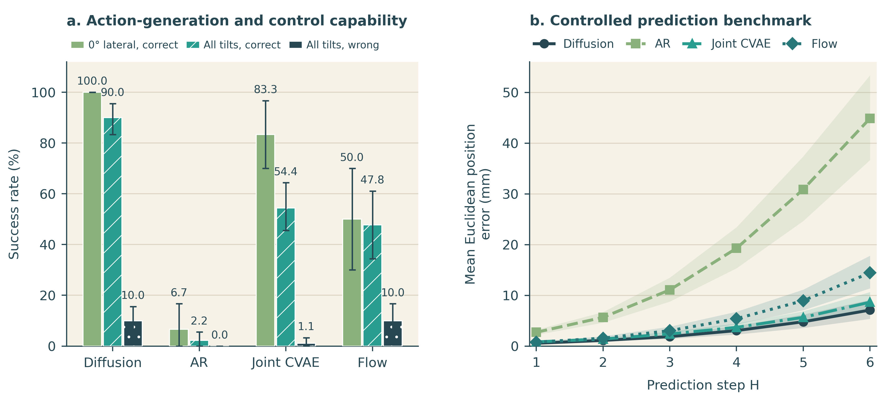
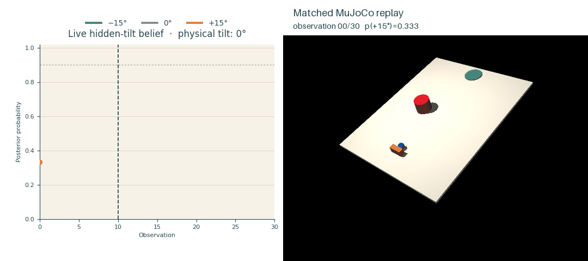

# Benchmarking Generative Trajectory Models for Active-Inference Control

Official code and result artifacts for the paper by Yulin Li, Mohsen A. Jafari, and Andrea Matta.
Published as a conference paper at **IWAI 2026**.

[Read the final paper (PDF)](paper/main.pdf)

The main paper is a **world-model benchmark**. Experiment 1 evaluates four shared trajectory-model families—Diffusion/DiT, autoregressive Transformer, joint CVAE, and flow matching—as action generators, controlled predictors, and observation-likelihood models. Experiment 2 replays identical actions and observations through the frozen models and measures belief adaptation after an unannounced 0° → +15° tilt change.

Appendix A is a separate, earlier **proposal-model benchmark**. It uses exact MuJoCo transitions to score proposed action sequences. That is appropriate for studying proposal quality and finite-budget search, but it is not a learned-world-model experiment and does not demonstrate the complete GenAIF loop. Its code, separate dataset, checkpoints, and measurements are isolated in [appendix_proposal/](appendix_proposal/README.md).

## Results at a glance



*Figure 2. Experiment 1 compares action-generation/control performance under correct and wrong tilt labels (left) and controlled prediction error over horizons H=1–6 (right). Error bars and bands resample the frozen evaluation blocks; they do not represent retraining variation.*



*Experiment 2 demo. The first ten transitions use 0° lateral tilt; the board then switches without announcement to +15°. The left panel updates the hidden-tilt posterior from each new observation while the right panel replays the identical recorded actions in MuJoCo. This is fixed replay: actions do not adapt to the belief. A representative case is used for visual clarity; aggregate results over all 12 switched trials and all four model families are reported in Figure 3 and Table 3.*

## Repository contents

- `aif/`, `data/`, `environment/`, `envs/`, `evaluation/`, `generators/`, `mujoco_task/`, `training/`: main-paper implementation.
- `configs/`: frozen E1/E2 protocols and the four seed-13 model recipes.
- `datasets/uphill_push_v1/`: main training data and cache.
- `datasets/evaluation/`: fixed development, calibration, and test banks.
- `results/paper/`: compact reports, source CSVs, paper tables, and regenerated figures.
- `appendix_proposal/`: self-contained archived proposal-only experiment.
- `paper/main.pdf`: the final paper used to define the public release scope.

Large intermediate checkpoints and rollout directories are intentionally excluded. The main E1 checkpoints can be regenerated from the frozen training contract; the five smaller Appendix A checkpoints used by the paper are included.

## Installation

Python 3.11 and MuJoCo are required. With [uv](https://docs.astral.sh/uv/):

```bash
uv sync --extra dev
```

Or use a standard virtual environment and install with `pip install -e '.[dev]'`.

## Verify the archived paper values

This command recomputes all five paper tables from the retained machine-readable artifacts, including the episode-weighted timing estimator used by Appendix Table A2:

```bash
uv run python scripts/verify_paper_results.py
```

Regenerate every paper figure from the retained sources:

```bash
uv run python scripts/build_benchmark_figures.py
uv run python scripts/experiment2_switching_plus15.py --output results/paper/experiment2 --plot-only
uv run python scripts/build_appendix_figure.py
uv run python scripts/render_environment_figure.py
```

Regenerate the animated E2 demo by replaying its retained actions in MuJoCo; this performs no model inference:

```bash
uv run python scripts/build_e2_demo_gif.py
```

## Reproduce the main experiments

The complete E1 pipeline creates recipes, trains the four seed-13 models, selects checkpoints on development data, calibrates likelihoods, freezes the protocol, and runs the sealed test campaign:

```bash
uv run --extra dev python scripts/experiment1_full.py --stage all
uv run python scripts/build_benchmark_figures.py --recompute-source
```

The exact run used an NVIDIA GPU with a 450 W power limit. Training is intentionally explicit and long-running. E2 consumes the resulting selected checkpoints and frozen calibrations:

```bash
uv run python scripts/experiment2_switching_plus15.py --device cuda
```

See [docs/reproducibility.md](docs/reproducibility.md) for artifact provenance, estimators, and the distinction between the main and appendix tracks.

## Tests

```bash
uv run --extra dev pytest
```

## License

Released under the [Apache License 2.0](LICENSE).

## Citation

Citation metadata is in [CITATION.cff](CITATION.cff). Please cite the paper if you use this code or the released benchmark artifacts.
